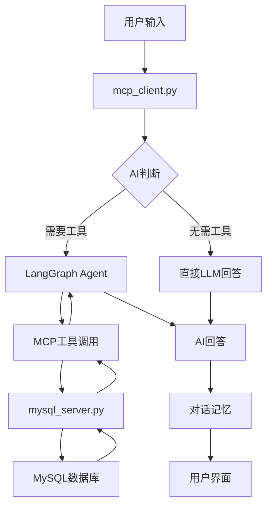

# MySQL数据库管理助手

## 项目介绍

这是一个基于 **LangChain** 和 **MCP (Model Context Protocol)** 的智能MySQL数据库管理助手。项目集成了先进的AI技术，提供自然语言交互的数据库操作体验，支持完整的MySQL数据库CRUD操作。

### 核心特性

- 🤖 **AI驱动**: 基于LangChain框架，支持自然语言数据库操作
- 🔧 **完整CRUD**: 支持数据库和表的创建、数据增删改查等全套操作
- 💬 **智能对话**: 内置对话记忆功能，支持上下文理解
- 🛠️ **MCP集成**: 使用Model Context Protocol实现模块化服务架构
- 🔄 **流式响应**: 支持实时流式AI回复，提升用户体验
- 🎯 **智能判断**: AI自动判断何时需要调用数据库工具

## 项目结构

```
agent_code/
├── README.md                 # 项目说明文档
├── requirements.txt          # Python依赖包列表
├── .env                      # 环境变量配置文件（需要创建）
├── .env.example             # 环境变量模板文件
├── .gitignore               # Git忽略文件配置
├── mcp_client.py            # 主客户端程序（LangChain + MCP集成）
├── test_table_analyzer.py   # 表设计分析器测试脚本
└── mcp_servers/             # MCP服务器目录
    ├── mysql_server.py      # MySQL数据库操作MCP服务器
    └── table_design_analyzer.py  # 表设计分析MCP服务器（新增）
```

## 核心组件

- **`mcp_client.py`**: 主客户端程序，集成LangChain ReAct Agent和对话记忆功能
- **`mcp_servers/mysql_server.py`**: MySQL数据库操作MCP服务器，提供完整的数据库操作工具
- **`mcp_servers/table_design_analyzer.py`**: 表设计分析MCP服务器，提供专业的表设计评判功能
- **`test_table_analyzer.py`**: 表设计分析器测试脚本，用于验证新功能
- **`requirements.txt`**: 项目依赖管理文件，包含所有必需的Python包
- **`.env`**: 环境变量配置文件，存储敏感信息（API密钥、数据库密码等）
- **`.env.example`**: 环境变量模板文件，提供配置示例

## 主要功能

### 数据库操作功能
- ✅ **创建数据库**: 创建新的MySQL数据库
- ✅ **创建表**: 在指定数据库中创建数据表
- ✅ **插入数据**: 向表中插入新数据记录
- ✅ **更新数据**: 修改表中的现有数据
- ✅ **删除数据**: 删除表中的指定数据
- ✅ **查询数据**: 查询和检索表中的数据
- ✅ **查看数据库**: 显示所有可用数据库
- ✅ **查看表**: 显示指定数据库中的所有表

### 表结构分析功能
- 🔍 **查看表结构**: 详细显示表的字段信息、数据类型、约束等
- 📊 **索引信息**: 显示表的索引配置和性能优化信息
- 📝 **建表语句**: 显示完整的CREATE TABLE语句

### 表设计分析功能（新增！）
- 🎯 **表设计评判**: 全面分析表设计，提供专业评判和优化建议
- 📋 **命名规范检查**: 检查表名和字段名是否符合最佳实践
- 🔧 **数据类型分析**: 评估数据类型选择的合理性
- 🚀 **索引设计评估**: 分析索引配置，发现性能问题
- ⚡ **性能问题检测**: 识别可能影响性能的设计问题
- 💡 **优化建议**: 提供具体的改进建议和最佳实践

### AI交互功能
- 🧠 **智能判断**: AI自动识别是否需要调用数据库工具
- 💭 **自然对话**: 支持MySQL知识问答和概念解释
- 🔄 **上下文记忆**: 保持对话历史，支持连续交互
- 📝 **详细反馈**: 提供操作结果和错误提示
- 🛡️ **智能安全**: 数据操作前自动查看表结构，确保操作安全性

## 技术栈

### 核心框架
- **LangChain**: AI应用开发框架，提供Agent和工具集成
- **LangGraph**: ReAct Agent实现，支持工具调用和推理
- **FastMCP**: 高性能MCP服务器框架
- **MCP**: Model Context Protocol，模型上下文协议

### AI模型支持
- **OpenAI API**: 支持GPT系列模型（当前配置为火山引擎）
- **Ollama**: 支持本地部署的开源模型

### 数据库
- **MySQL**: 主要数据库系统
- **PyMySQL**: Python MySQL连接器

## 环境要求

- **Python**: 3.10+
- **MySQL**: 5.7+ 或 8.0+
- **操作系统**: Windows, macOS, Linux

## 安装指南

### 1. 克隆项目
```bash
git clone <repository-url>
cd agent_code
```

### 2. 安装Python依赖
```bash
pip install -r requirements.txt
```

### 3. 配置环境变量
复制环境变量模板文件并配置：
```bash
cp .env.example .env
```

编辑 `.env` 文件，配置您的设置：
```bash
# AI模型配置
OPENAI_MODEL=your-model-name
OPENAI_API_KEY=your-api-key-here
OPENAI_BASE_URL=https://api.openai.com/v1

# MySQL数据库配置
MYSQL_HOST=127.0.0.1
MYSQL_PORT=3306
MYSQL_USER=root
MYSQL_PASSWORD=your-mysql-password

# 应用配置
TEMPERATURE=0.3
MEMORY_WINDOW_SIZE=10
```

### 4. 配置MySQL数据库
确保MySQL服务正在运行，数据库连接信息已在 `.env` 文件中配置。

> 💡 **提示**: 所有配置都通过环境变量管理，确保安全性

### 5. 配置AI模型
项目支持多种AI模型，通过环境变量配置：

#### 使用OpenAI兼容API（如火山引擎）
在 `.env` 文件中配置：
```bash
OPENAI_MODEL=ep-20250425235702-887jj
OPENAI_API_KEY=your-api-key
OPENAI_BASE_URL=https://ark.cn-beijing.volces.com/api/v3
```

#### 使用Ollama本地模型
1. 在 `.env` 文件中配置Ollama设置：
```bash
OLLAMA_MODEL=qwen3:14b
OLLAMA_BASE_URL=http://localhost:11434
```

2. 在 `mcp_client.py` 中取消注释Ollama配置代码：
```python
# 取消注释以下代码
from langchain_ollama import ChatOllama
llm = ChatOllama(
    model=os.getenv("OLLAMA_MODEL", "qwen3:14b"),
    base_url=os.getenv("OLLAMA_BASE_URL", "http://localhost:11434"),
    temperature=float(os.getenv("TEMPERATURE", "0.3"))
)
```

## 使用方法

### 启动应用
```bash
python mcp_client.py
```

### 交互示例

#### 1. 创建数据库
```
💬 问题: 创建一个名为 company 的数据库
🎯 回答: ✅ 成功创建数据库: company
```

#### 2. 创建数据表
```
💬 问题: 在 company 数据库中创建一个员工表，包含id、姓名、年龄、部门字段
🎯 回答: ✅ 成功在数据库 company 中创建表: employees
```

#### 3. 插入数据
```
💬 问题: 向员工表插入一条记录：张三，28岁，技术部
🎯 回答: ✅ 成功向表 employees 插入 1 行数据
```

#### 4. 查看表结构（新功能）
```
💬 问题: 查看员工表的结构
🎯 回答: 📋 表 company.employees 的结构信息:
================================================================================
字段名               数据类型              允许NULL    键        默认值          额外信息
--------------------------------------------------------------------------------
id                  int(11)              NO         PRI       NULL           auto_increment
name                varchar(100)         NO                   NULL
age                 int(11)              YES                  NULL
department          varchar(50)          NO                   技术部
created_at          timestamp            NO                   CURRENT_TIMESTAMP
================================================================================
📊 共 5 个字段
```

#### 5. 查询数据
```
💬 问题: 查询所有员工信息
🎯 回答: 📋 查询结果 (共 1 行):
第 1 行: {
  "id": 1,
  "name": "张三",
  "age": 28,
  "department": "技术部"
}
```

#### 6. 智能数据插入（AI自动查看表结构）
```
💬 问题: 向员工表插入一个新员工：李四，30岁，市场部
🎯 AI流程:
1. 🔍 自动调用 describe_table 查看表结构
2. 📊 分析字段要求：id自增，name和department必填，age可选
3. 📝 构造符合表结构的JSON数据
4. ✅ 执行插入操作
```

#### 7. MySQL知识问答
```
💬 问题: 什么是MySQL的索引？
🎯 回答: MySQL索引是一种数据结构，用于快速定位表中的数据行...
```

## 高级功能

### 对话记忆
项目集成了LangChain的对话记忆功能：
- 保留最近10轮对话历史
- 支持上下文理解和连续交互
- 自动管理对话状态

### 智能工具调用
AI会智能判断何时需要调用数据库工具：
- **需要工具**: 数据库操作、数据查询、表结构查看等实际操作
- **无需工具**: 概念解释、知识问答、一般对话

### 智能表结构分析（核心特性）
AI在执行数据操作前会自动进行表结构分析：
- 🔍 **自动查看表结构**: 在插入、更新数据前自动调用 `describe_table`
- 📊 **字段类型验证**: 确保数据类型与表结构匹配
- 🛡️ **约束检查**: 验证NOT NULL、主键、唯一约束等
- 📏 **长度验证**: 检查字符串长度是否超过字段限制
- 🔑 **主键处理**: 自动识别AUTO_INCREMENT字段，避免手动指定

### 流式响应
- 实时显示AI思考过程
- 流式输出回答内容
- 提升用户交互体验

## 故障排除

### 常见问题

#### 1. MySQL连接失败
```
❌ MySQL连接失败: (2003, "Can't connect to MySQL server")
```
**解决方案**:
- 确保MySQL服务正在运行
- 检查连接配置（主机、端口、用户名、密码）
- 确认防火墙设置

#### 2. 依赖包安装失败
```
❌ ERROR: Could not find a version that satisfies the requirement
```
**解决方案**:
- 升级pip: `pip install --upgrade pip`
- 使用国内镜像: `pip install -r requirements.txt -i https://pypi.tuna.tsinghua.edu.cn/simple/`

#### 3. AI模型调用失败
```
❌ OpenAI API调用失败
```
**解决方案**:
- 检查API密钥是否正确
- 确认网络连接正常
- 考虑切换到Ollama本地模型

#### 4. MCP服务器启动失败
```
❌ 初始化失败: MCP server connection error
```
**解决方案**:
- 检查Python路径是否正确
- 确认mcp_servers目录存在
- 查看详细错误日志

### 调试模式
启用详细日志输出：
```python
import logging
logging.basicConfig(level=logging.DEBUG)
```

## 扩展开发

### 添加新的数据库操作
1. 在 `mysql_server.py` 中添加新的工具函数
2. 使用 `@mcp.tool()` 装饰器注册工具
3. 更新客户端提示词以包含新功能

### 集成其他数据库
- 创建新的MCP服务器（如 `postgresql_server.py`）
- 在客户端配置中添加新服务器
- 更新AI提示词以支持多数据库操作

### 自定义AI模型
- 修改 `mcp_client.py` 中的模型配置
- 调整温度参数和其他模型设置
- 优化提示词以适配特定模型

## 项目架构



## 贡献指南

我们欢迎社区贡献！请遵循以下步骤：

1. **Fork项目** 到您的GitHub账户
2. **创建特性分支**: `git checkout -b feature/amazing-feature`
3. **提交更改**: `git commit -m 'Add amazing feature'`
4. **推送分支**: `git push origin feature/amazing-feature`
5. **创建Pull Request**

### 代码规范
- 遵循PEP 8 Python代码规范
- 添加适当的注释和文档字符串
- 编写单元测试覆盖新功能
- 更新README文档

## 许可证

本项目采用 **MIT许可证**。详情请查看 [LICENSE](LICENSE) 文件。

## 作者信息

- **作者**: FangGL
- **创建日期**: 2025-01-07
- **联系方式**: [GitHub](https://github.com/your-username)

## 致谢

感谢以下开源项目的支持：
- [LangChain](https://github.com/langchain-ai/langchain) - AI应用开发框架
- [FastMCP](https://github.com/jlowin/fastmcp) - MCP服务器框架
- [PyMySQL](https://github.com/PyMySQL/PyMySQL) - MySQL连接器

## 更新日志

### v1.0.0 (2025-01-07)
- ✅ 初始版本发布
- ✅ 完整的MySQL CRUD操作支持
- ✅ LangChain Agent集成
- ✅ 对话记忆功能
- ✅ 智能工具调用判断
- ✅ 流式响应支持

---

**⭐ 如果这个项目对您有帮助，请给我们一个Star！**